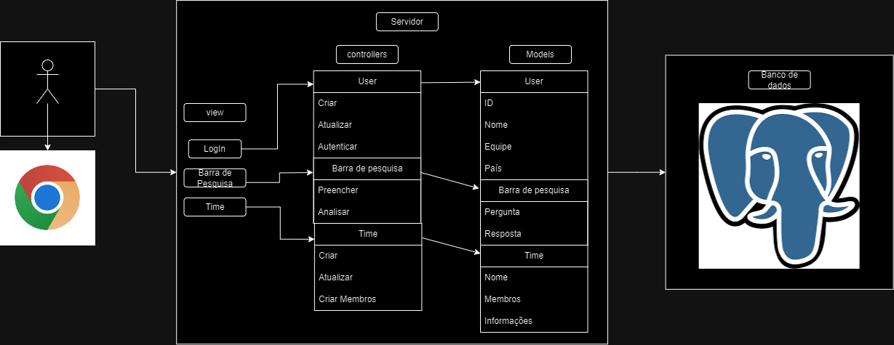

  

**Principais Funcionalidades:**
- **Autenticação de Usuário:** Permitir o login seguro dos estudantes.
- **Pesquisa e Análise:** Capacitar estudantes a pesquisar e analisar informações relevantes.
- **Gerenciamento de Equipes:** Possibilitar a criação e atualização de informações das equipes e seus membros.

**Modelos**
- **User:** Armazena atributos como ID, nome, equipe, e país.
- **Barra de Pesquisa:** Gerencia as funcionalidades de pesquisa, incluindo perguntas e respostas.
- **Time (Equipe):** Detém informações sobre as equipes, seus membros e dados relevantes.

**Controladores**
- **UserController:** Responsável por criar, atualizar e autenticar usuários.
- **Barra de Pesquisa Controller:** Lida com as funcionalidades de preenchimento e análise das pesquisas.
- **Time Controller:** Gerencia a criação e atualização de equipes e membros.

**Visões**
- **Login:** Interface para autenticação dos usuários.
- **Barra de Pesquisa:** Para realizar e exibir os resultados das pesquisas.
- **Time:** Visualização e gerenciamento das equipes e membros.

**Infraestrutura**
- **Banco de Dados:** Utiliza PostgreSQL para armazenar e gerenciar dados do usuário, pesquisa e equipes.
- **Servidor:** A lógica de negócio é processada no servidor, onde reside a arquitetura MVC.
